# Winternacht Color Theme


## Description
A dark VSCode theme inspired by and crafted during the cold, dark scandinavian
winter nights. Designed to be easy on the eyes during long coding sessions in
dark environments.

If you like the theme and have found it useful, please leave a comment.
Suggestions for improvement are also welcome.

## Credits
The theme is inspired by Ayu Mirage, Halcyon and Cobalt2 themes that I have greatly enjoyed
and used heavily in the past.

## Supported Languages
The theme is optimized for and tested with the following tech-stack:

* Python
* Robot Framework
* TypeScript
* React
* Go
* PHP
* Markdown
* HTML
* JSON
* YAML
* Jenkinsfile (Groovy)
* Dockerfile
* Properties
* Dotfiles

## Colors

### Syntax

|                               Color                      | Usage                                                              |
| :------------------------------------------------------: | ------------------------------------------------------------------ |
| 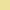 `#ede29c`     | Functions, methods                                                 |
| 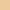 `#edca9c`     | Builtins, library names, support functions, decorators, type hints |
| 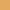 `#e3a95f`      | Object definitions, classes, operators                             |
|  `#eda39c`        | Control keywords, constructors, modifiers, interfaces, constants   |
| 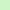 `#cef5c7` | Quoted and unquoted strings                                        |
|  `#bdf1b1`   | Docstrings, string templates, string punctuation                   |
| 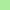 `#abed9c`      | Numeric constants                                                  |
|  `#5fb7e3`      | JSON keys                                                          |


### Workbench
|                               Color                        | Usage                           |
| :--------------------------------------------------------: | ------------------------------- |
| 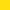 `#ffdf0f` | Badges, buttons, editor cursor  |
| 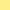 `#ffef8a`   | Highlights, borders, warnings   |
| 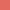 `#e36a5f`         | Errors                          |
|  `#257dc1`        | Selections                      |
| 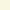 `#f9f7e1`                 | Default foreground              |
|  `#142a39`                 | Default background              |


## Recommended Settings

### [Nerd Fonts](https://www.nerdfonts.com)
If you code, I especially recommend using Nerd Fonts with font ligatures enabled.

There is a massive number of fonts available, and the choice largely comes down to personal preference.

I have found the following font combination and ligature configuration to suit me well:

```json
    "editor.fontFamily": "FiraCode Nerd Font",
    "editor.codeLensFontFamily": "Big Blue Terminal Nerd Font",
    "terminal.integrated.fontFamily": "Hack Nerd Font",
```
```json
    "editor.fontLigatures": "'ss01', 'ss02', 'ss03', 'ss04', 'ss05', 'ss08', 'cv09', 'cv14', 'cv18', 'onum'",
```
### Bracket Pair Colorizer
The theme defines a set of colors for the built-in bracket pair colorizer feature.

An example of bracket coloring is shown in the image below:

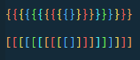

You can enable this feature with the following options:

```json
    "editor.bracketPairColorization.enabled": true,
    "editor.bracketPairColorization.independentColorPoolPerBracketType": true,
```

## Complementing Extensions
You might find the following extensions and sample settings useful.

### [Indent Rainbow (oderwat.indent-rainbow)](https://marketplace.visualstudio.com/items?itemName=oderwat.indent-rainbow)

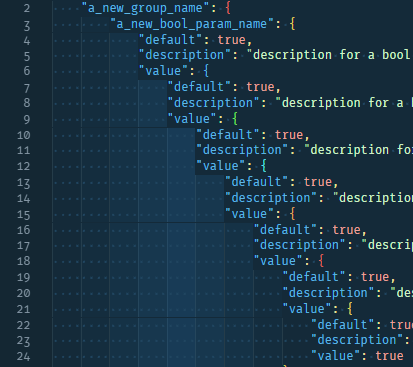
```json
    "indentRainbow.colors": [
        "#257dc100",
        "#257dc109",
        "#257dc118",
        "#257dc127",
        "#257dc136",
        "#257dc127",
        "#257dc118",
        "#257dc109",
    ],
    "indentRainbow.errorColor": "#cc322499",
    "indentRainbow.indicatorStyle": "classic",
```

### [Material Icon Theme (PKief.material-icon-theme)](https://marketplace.visualstudio.com/items?itemName=PKief.material-icon-theme)


```json
    "workbench.iconTheme": "material-icon-theme",
    "material-icon-theme.activeIconPack": "react",
    "material-icon-theme.files.color": "#257dc1",
    "material-icon-theme.folders.color": "#257dc1",
    "material-icon-theme.folders.theme": "specific",
    "material-icon-theme.opacity": 0.8
```
