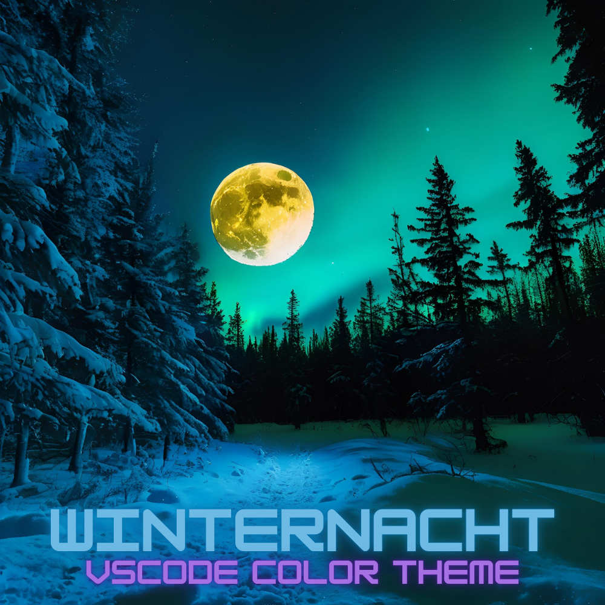

# Winternacht Color Theme

A dark VSCode theme inspired by and crafted during the cold, dark Finnish winter
nights. Designed to be easy on the eyes during long coding sessions in dark
environments.

The theme is inspired by Halcyon and Cobalt2 themes that I have greatly enjoyed
and used heavily in the past.

The syntax highlighting is optimized for and tested with the following
tech-stack:

* Python
* Robot Framework
* TypeScript
* Markdown
* JSON & YAML
* Properties & Dotfiles

If you like the theme and have found it useful, please leave a comment.
Suggestions for improvement are also welcome.
